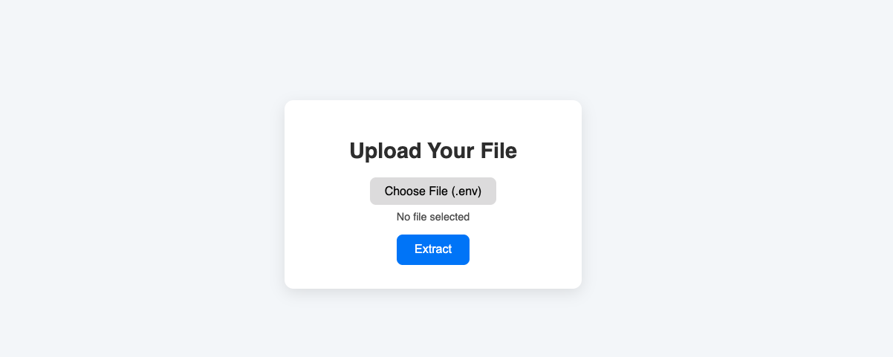

# env-cracker-web

This app let you upload proprietary file with ".env" extension and download the zip with all the content

## Run project with docker

1. run :  `docker pull nicolasbellanich/env-cracker-web:latest`
1. run :  `docker run -p 8080:8080 nicolasbellanich/env-cracker-web:latest`
